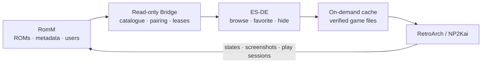

# RomM ES-DE Bridge

[](https://github.com/Mrzhao2018/romm-esde-bridge/actions/workflows/test.yml)
[](LICENSE)

Use a self-hosted [RomM](https://github.com/rommapp/romm) library as the
source of truth for ES-DE on Steam Deck/SteamOS and Windows. Browse the full
catalogue and RomM artwork locally, then download verified ROM content only
when a game is launched. Favorites, hidden flags, play sessions, RetroArch
states and state screenshots synchronize per RomM user.

> [!IMPORTANT]
> The current launcher profile is production-tested for PC-98 with RetroArch
> NP2Kai. The catalogue and synchronization protocol are platform-neutral, but
> additional emulator launch profiles still need to be implemented and tested.



## Quick start

New-device deployment and the platform support matrix are documented in
[`CLIENT_DEPLOYMENT.md`](CLIENT_DEPLOYMENT.md). SteamOS/Linux entry point:

```bash
curl -fsSL http://romm-server.local:8090/bootstrap/install.sh | bash
```

Windows x64 PowerShell entry point:

```powershell
irm http://romm-server.local:8090/bootstrap/install.ps1 | iex
```

Replace `romm-server.local` with the hostname or address of your Bridge. Server
setup is documented in [`SERVER_DEPLOYMENT.md`](SERVER_DEPLOYMENT.md).

## Design

The server component is a read-only catalogue adapter for an ES-DE on-demand
launcher. It requires Python 3.11+ and a compatible RomM 5.x deployment.

The bridge reads RomM through a least-privilege Client API Token and exports
one user-neutral shared game catalogue:

- `catalog.json`: RomM capabilities, platforms and collections
- `platforms/<slug>/manifest.json`: rich RomM metadata, file lists, firmware,
  local RomM media URLs and authenticated download endpoints
- `platforms/<slug>/gamelist.xml`: ES-DE metadata
- `platforms/<slug>/esde-stubs.zip`: tiny `.romm` launch stubs

Provider URLs are deliberately stripped because some upstream URLs can contain
provider credentials. Covers and screenshots point to RomM's local asset paths.
No ROM, BIOS or client token is included in an export. No favorite, hidden
flag, private collection or other service-token user data is included either.
Each client overlays those fields with its own RomM token. Different users
therefore share one ROM, firmware and artwork library while retaining
independent personal data.
Non-admin users should be assigned RomM's `Viewer (legacy)` permission group:
it grants shared library/download access plus write access to only their own
collections, assets, devices and per-ROM progress. `Editor` is unnecessary for
playing and would also grant library mutation rights.
RomM omits a token owner's hidden ROMs from list endpoints. The Bridge therefore
uses the previous complete manifest (or a read-only client SQLite seed during
the v3 migration) to recover those IDs through RomM's authenticated detail API,
and refuses to publish if the result differs from the platform's global count.

The Deck uses its own RomM Client API token, registered device, local SQLite
index and bounded on-demand cache. The existing EmuDeck `pc98` system remains
separate and untouched; this integration appears as `RomM · PC-98`.
Every installation owns a persistent client-instance UUID and a distinct RomM
Device record. A data directory is bound to exactly one RomM user; switching a
token to another user requires a separate `data_dir`.

## Installed services

Server:

- `romm-esde-bridge.service`: static export on port 8090
- RomM `项目说明` module: an in-app project guide backed by
  `/project/`, including live Bridge catalogue health and deployment commands
- `romm-esde-bridge-refresh.timer`: refresh export every 15 minutes
- `romm-esde-deck-backup.timer`: versioned Deck config backup every day

Steam Deck user services:

- ES-DE session wrapper: catalog and artwork refresh before launch, user flags
  are watched while ES-DE runs, and a final favorite/hidden push runs on exit
- `romm-esde-sync.timer` and `romm-esde-media.timer` are installed only as
  definitions for compatibility and remain disabled; clients do not poll
- `romm-esde-config.path`: restores the custom ES-DE system after EmuDeck rewrites
- `romm-esde-launcher.path`: restores the on-demand session wrapper after EmuDeck rewrites

## Deck commands

```sh
romm-esde-sync
romm-esde-doctor
romm-esde-cache
systemctl --user status romm-esde-media.service
tail -n 100 ~/.local/state/romm-esde/launch.log
```

ROMs are downloaded only when launched. Downloads use `.part` files, HTTP
Range, size and SHA-1/MD5 validation, then an atomic rename. The cache defaults
to 50 GiB and preserves at least 20% free disk space. Multi-disk downloads only
request RomM files categorized as `game`; RomM's generated M3U is accepted only
when it references exactly those canonical disks.

For a ZIP containing one disk image, RomM's SHA-1/MD5 fields describe the
inner disk rather than the outer ZIP. The client therefore validates the ZIP
size and hashes its single member. A complete `.part` is validated and promoted
without issuing an invalid end-of-file Range request.

RetroArch auto states and their `.state.auto.png` thumbnails are pulled before
launch and pushed after exit as a pair using RomM's native `screenshotFile`.
Either file changing triggers an update. Conflicts are preserved beside the
state or screenshot with a timestamp. Play sessions use an offline
SQLite outbox. ES-DE favorite/hidden values use three-way merge with RomM.
State uploads take a short cooperative Bridge lease keyed by `(user, ROM)` and
re-read the server revision. If another device changed it, the server pair is
first saved as a timestamped archival state before the local canonical pair is
committed.
Deck-side edits are detected from `gamelist.xml` and pushed while the ES-DE
session is active. The post-session push is the recovery path; no periodic
client poll is needed.
Full synchronization never rewrites `gamelist.xml` while ES-DE is running.
The EmuDeck launcher performs a sync before ES-DE loads and after it exits,
because ES-DE keeps game metadata in memory and does not hot-reload external
gamelist edits safely.
RomM 5 represents favorites as membership in its special favorite collection.
The Deck reads that collection directly at each safe synchronization and keeps
a per-user cached overlay for hidden flags.

The Deck's built-in controller has an explicit SDL2 autoconfig for vendor/product
`10462/4613`. NP2Kai uses `Arrows 3button`: D-pad maps to PC-98 arrow keys,
face buttons follow the core's documented X/Z/Space mappings and Start maps
Return. Select opens the NP2 menu for disk changes; Right stick mouse emulation
remains enabled. Select+Start is the RetroArch exit hotkey.

Canonical multi-disk ZIPs are verified, then their selected disks are kept in a
per-game cache directory. A stable `romm-ID` symlink launches disk A so state
names remain stable; disk B and later disks are available in the same directory
from the NP2 menu. Alternate dumps are never extracted.

NP2Kai has a core-specific Deck profile: core-provided 8:5 aspect ratio, exact
2x integer scaling from 640x400 to 1280x800, nearest-neighbor pixels, shaders
off, non-threaded VSync, two swapchain images and synchronized 64 ms audio.
Run-Ahead, preemptive frames and rewind stay off because this computer core uses
states and disk control. The emulated machine remains the compatible default
PC-9801VM/80386/2.4576 MHz x4; higher multipliers can make software run too fast.
The launcher replaces Steam pressure-vessel's private D-Bus address with the
Deck user bus, forces a UTF-8 locale and drops the mixed-architecture overlay
preload before entering Flatpak, preventing NP2 file-dialog and shutdown faults.

Backups are stored below:

```text
/var/lib/romm-esde-bridge/device-backups/steamdeck/history/
/var/lib/romm-esde-bridge/device-backups/steamdeck/current
```

Deployment rules for additional users and devices are in `MULTI_DEVICE.md`.
Copy `bridge.env.example` and `deck-config.example.toml` for public,
credential-free configuration examples. Machine-specific operational notes and
live configuration are deliberately excluded from version control.

## Development

The project uses only the Python standard library at runtime. Run its tests with:

```bash
python3 -m unittest discover -p 'test_*.py' -v
```

See [`CONTRIBUTING.md`](CONTRIBUTING.md) for contribution expectations and
[`SECURITY.md`](SECURITY.md) for reporting security issues. This project is not
affiliated with RomM, ES-DE, EmuDeck or RetroArch.
